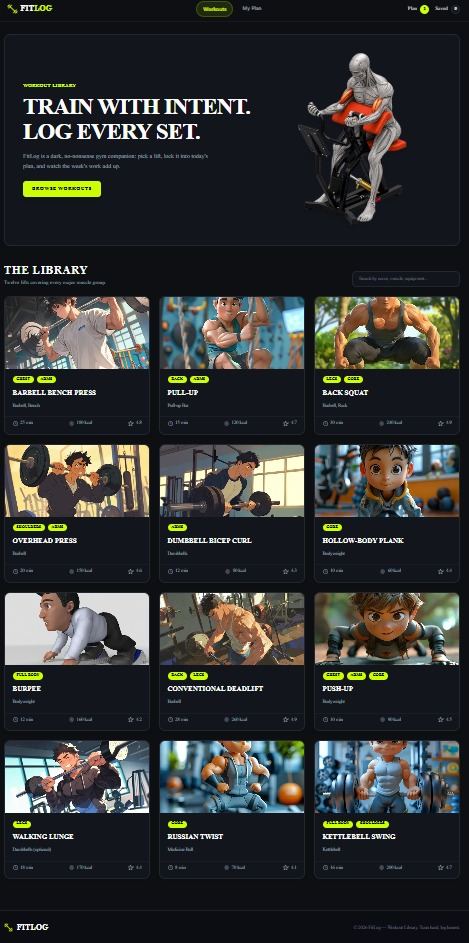
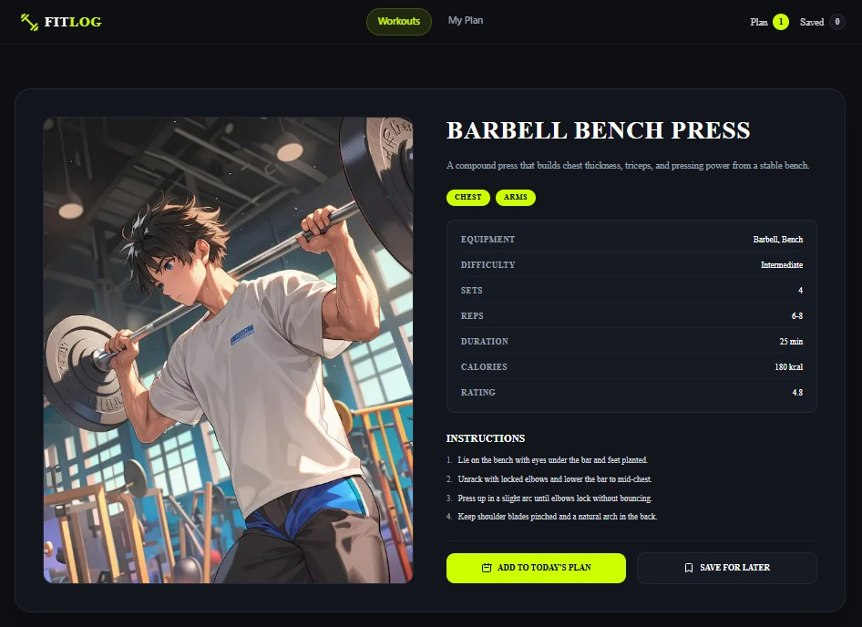
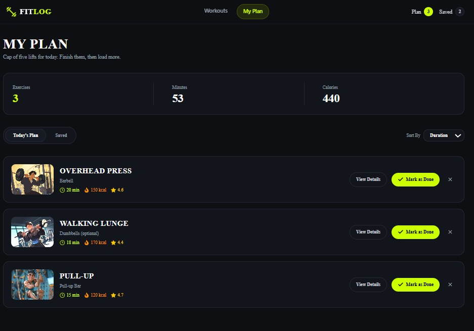
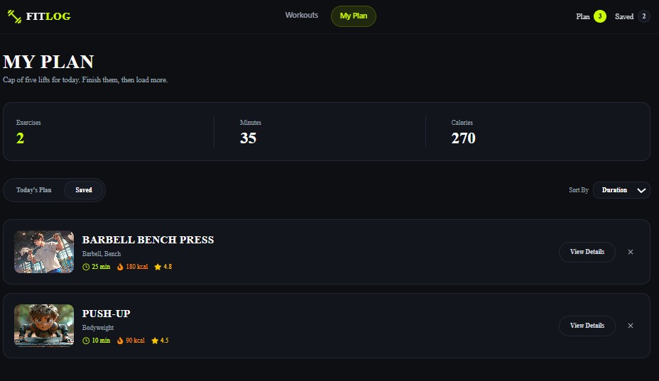

# 💪 FITLOG - Fitness & Workout Tracking Application

FitLog is a modern, responsive web application designed to help users browse workouts, manage daily training plans, and track saved exercises seamlessly. Built with performance and user experience in mind, it provides a clean interface for managing fitness goals.

🌐 **Live Website:** [Visit Website](https://fit-log-gamma-jet.vercel.app/)

---

## 📸 Application Interface

<p align="center">
  
  
</p>

<p align="center">
  
  
</p>

---

## 🛠️ Tech Stack

- **Framework:** Next.js (App Router)
- **Language:** TypeScript
- **Styling:** Tailwind CSS
- **State Management:** React Context API
- **Icons & UI Utilities:** Lucide React / DaisyUI
- **Deployment:** Vercel

---

## ✨ Key Features

### 1. Dynamic Daily Workout Planning

Users can build and view their customized daily workout routine with real-time tracking for total exercises, workout duration, and calories burned.

### 2. Saved Exercises & Navigation Sync

Seamless interaction between saved exercises and daily workout plans, with dynamic badge indicators in the header navigation.

### 3. Smart Sorting & Filtering

Users can sort workout routines based on:

- Duration
- Total calories
- User ratings

This makes it easier to find suitable workouts for different training sessions.

### 4. Interactive Workout Details

Each workout has a dedicated details page displaying:

- Exercise information
- Target statistics
- Workout duration
- Calories burned
- User ratings
- Dynamic navigation
- Save and plan state toggles

### 5. Optimized UX & Build-Safe Routing

The application includes:

- Client-side suspense boundaries
- Loading states
- Custom 404 pages
- Dynamic route handling
- Responsive layouts
- Mobile and desktop support

---

## 📁 Project Structure

```text
fit-log/
├── src/
│   ├── app/
│   │   ├── my-plan/
│   │   ├── workout/
│   │   │   └── [id]/
│   │   │       ├── not-found.tsx
│   │   │       └── page.tsx
│   │   ├── globals.css
│   │   ├── layout.tsx
│   │   ├── loading.tsx
│   │   ├── not-found.tsx
│   │   └── page.tsx
│   │
│   ├── assets/
│   │   ├── banner.png
│   │   ├── image01.jpeg
│   │   ├── image02.jpeg
│   │   ├── image03.jpeg
│   │   ├── image04.jpeg
│   │   ├── image05.jpeg
│   │   └── logo.png
│   │
│   ├── components/
│   │   ├── details/
│   │   │   └── WorkoutCardDetail.tsx
│   │   ├── home/
│   │   │   ├── HeroBanner.tsx
│   │   │   ├── WorkoutCard.tsx
│   │   │   └── WorkoutLibrary.tsx
│   │   ├── layout/
│   │   │   ├── Footer.tsx
│   │   │   └── Navbar.tsx
│   │   └── my-plan/
│   │       ├── PlanWorkoutCard.tsx
│   │       └── SavedWorkoutCard.tsx
│   │
│   ├── context/
│   │   └── PlanContext.tsx
│   │
│   └── types/
│       └── workout.ts
│
├── .gitignore
└── AGENTS.md
```

---

## 🚀 Getting Started Locally

Follow these steps to run FitLog on your local machine.

### 1. Clone the Repository

git clone https://github.com/naderarrahman/fit-log.git
cd fit-log

### 2. Install Dependencies

npm install

### 3. Run the Development Server

npm run dev

### 4. Open in Browser

Navigate to:

http://localhost:3000

---

## 🌐 Live Project

🌐 **Live Website:** [Visit Website](https://fit-log-gamma-jet.vercel.app/)

🔗 **GitHub Repository:** [View Repository](https://github.com/naderarrahman/fit-log)

---

## 👨‍💻 Connect With Me

- **GitHub:** [Nader Ar Rahman](https://github.com/naderarrahman)
- **LinkedIn:** [Nader Ar Rahman](https://linkedin.com/in/naderarrahman/)
- **Facebook:** [Nader Ar Rahman](https://www.facebook.com/naderarrahman)

---

## 📄 License

This project was developed for learning, practice, and portfolio purposes.